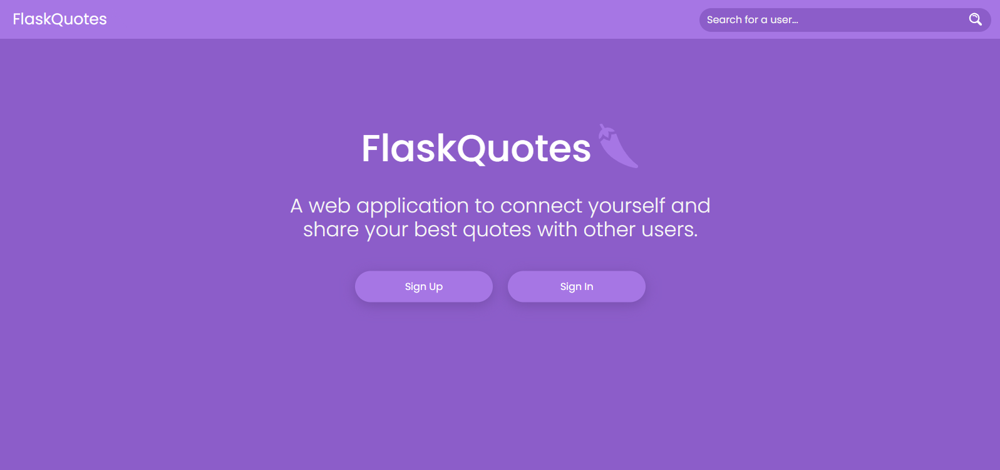
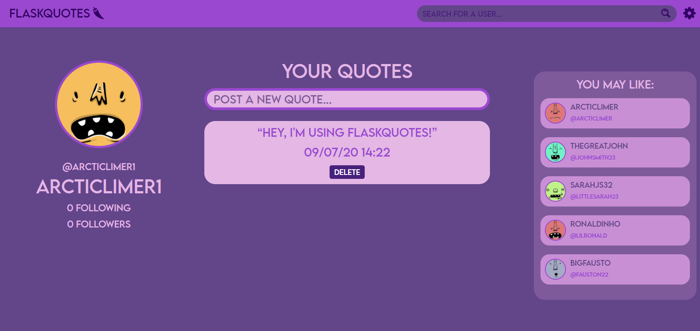
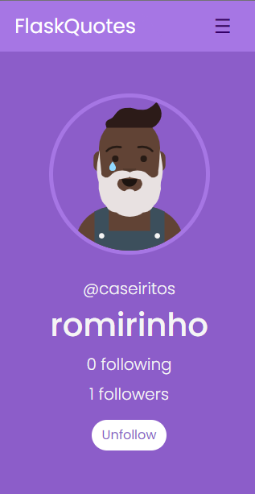

<p float="left">
    
    
</p>


&nbsp;
## 🤔 What is this?
It's a Flask-powered responsive web application project for sharing personal quotes.

&nbsp;
## ✨ Features:
- Functional mini social-media application
- An object relational SQLAlchemy database
- Modularized design using Flask blueprints
- Clean source code using decorators
- Responsive design

&nbsp;
## 🔨 TODO:
- Add docker support
- Replace server internal routes for a RESTful API design
- Add scroll into quotes session
- Like system
- Create users feed
- Automated tests
- SSL/HTTP support
- Add AJAX

&nbsp;
## ⚙️ Setting up the server:

- Clone or manually download this repository:

    ```bash
    git clone https://github.com/arcticlimer/flaskquotes.git
    ```

- Change to the source directory:

    ```bash
    cd flaskquotes/src
    ```

- Install the required modules:

    ```
    python -m pip install -r requirements.txt
    ```

- Start the app!

    ```
    flask run
    ```

- Now you can try it by going at localhost in your browser:

    ```
    http://localhost:5000
    ```
&nbsp;
## 🤝 Feel free to contribute and make your pull request!
